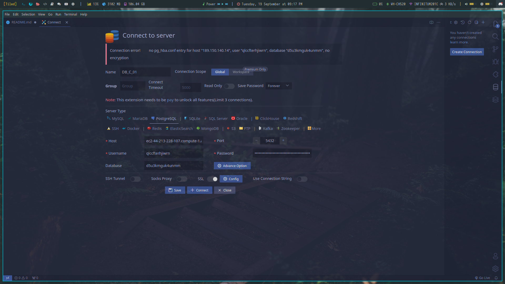

# Evidencia corte 01 Base de datos

## Conexion con Postgres

> Host: ec2-44-213-228-107.compute-1.amazonaws.com

> Database: d5u3kmguk4unmm

> User: qlccfterhjiwrn

> Port: 5432

> Password 4748d413ff7267e98422aaca2d70d22efffbcfd00c581004dfe3af18a3636ee3

### Conexion con psql
```
$ psql --host ec2-44-213-228-107.compute-1.amazonaws.com --port 5432 --username qlccfterhjiwrn --password --dbname d5u3kmguk4unmm
```
Despues del comando les pedira el password, solo es copiar y pegar.

### Conexion con Database Client de VSCode



* Seleccionar PostgreSql como base de datos
* Llenar los campos con las credenciales
* Habilitar SSL!!